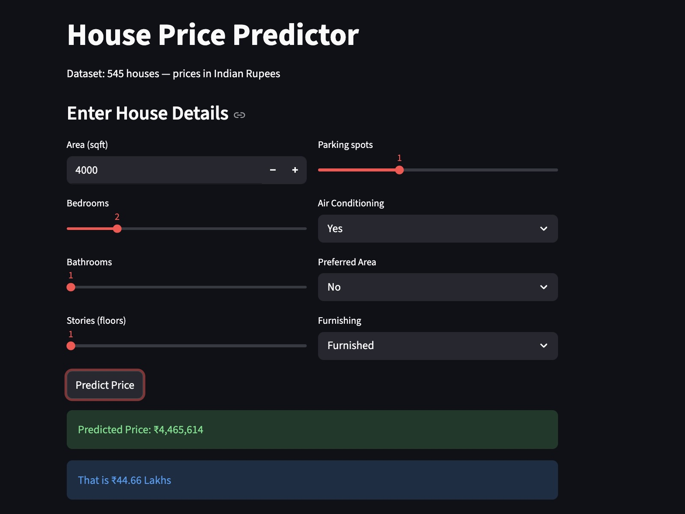
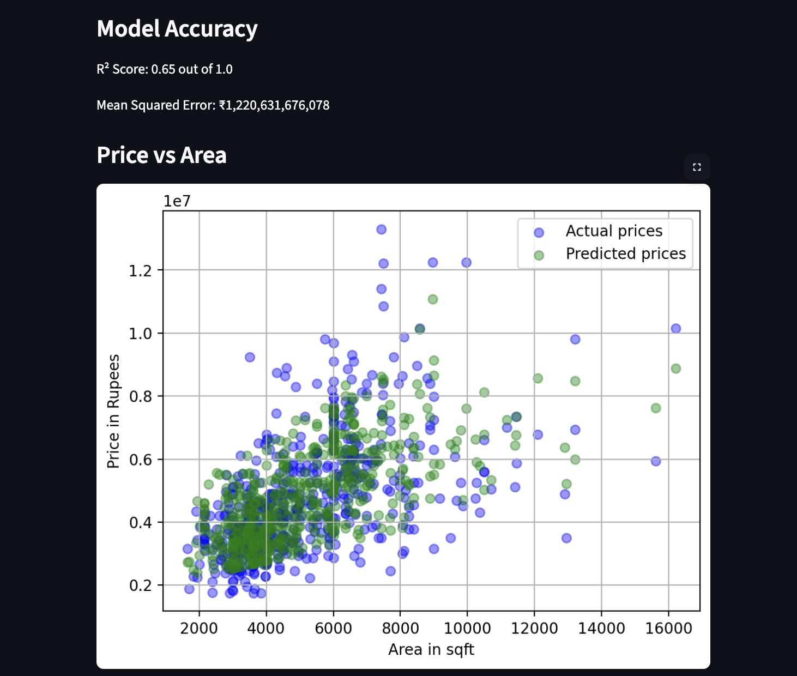

# House Price Prediction System

A machine learning web app that predicts house prices in India 
based on area, bedrooms, bathrooms, furnishing, and more.
Built with Linear Regression and deployed using Streamlit.




---

## Live Demo


---

## What it does

- Takes house details as input (area, bedrooms, bathrooms, 
  floors, parking, AC, furnishing, preferred area)
- Predicts the price instantly in Indian Rupees
- Shows a regression plot of area vs price
- Displays model accuracy metrics (MSE, slope, intercept)

---

## Dataset

- Source: Kaggle — Housing Price Dataset
- 545 real house records
- 13 features including area, bedrooms, bathrooms, 
  stories, parking, airconditioning, furnishingstatus
- Price range: ₹17.5 Lakhs to ₹1.33 Crore
- Average price: ₹47.7 Lakhs

---

## Model

| Detail | Value |
|---|---|
| Algorithm | Linear Regression |
| Library | scikit-learn |
| Features used | 8 (area, bedrooms, bathrooms, stories, parking, AC, prefarea, furnishing) |
| Encoding | Label Encoding + Binary Mapping |

---

## Tech Stack

- Python
- Pandas, NumPy
- Scikit-learn
- Matplotlib
- Streamlit

---

## How to run locally
```bash
git clone https://github.com/uniqueqamar/Housing-Price-Prediction-System
cd Housing-Price-Prediction-System
pip install -r requirements.txt
streamlit run housing.py
```

---

## Screenshots


---

## What I learned

- End-to-end ML workflow: data loading, preprocessing, 
  training, evaluation, and deployment
- Encoding categorical variables for ML models
- Building interactive web apps with Streamlit
- Feature engineering with multiple input variables
