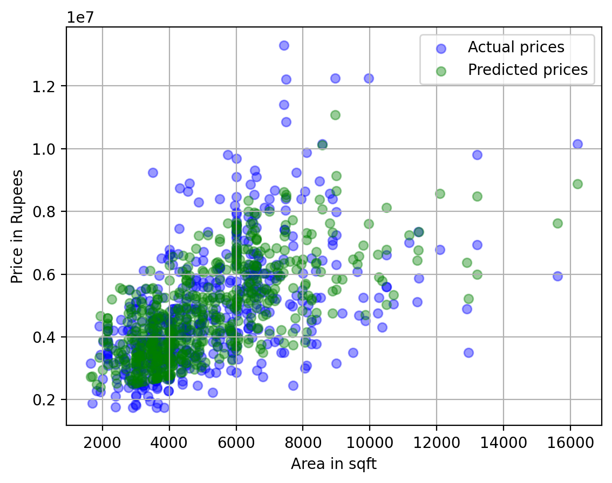

# 🏡 Housing Price Prediction System

A machine learning project that predicts house prices based on property area using **Linear Regression**.  
This project demonstrates the complete ML workflow including data loading, model training, evaluation, and visualization.

---

## 📌 Project Overview

The goal of this project is to build a regression model that can predict housing prices based on input features such as **area (square feet)**.

This is a **beginner-friendly machine learning project** that focuses on understanding:
- Regression techniques
- Model evaluation
- Data visualization

---

## ❓ Problem Statement

Accurately predicting house prices is important for:
- Buyers and sellers
- Real estate businesses
- Market analysis

This project builds a simple model that learns the relationship between **house area and price**.

---

## 📊 Dataset

- Source: CSV file (local dataset)
- Features used:
  - `area` → Area of the house (sq ft)
- Target variable:
  - `price` → House price

---

## ⚙️ Technologies Used

- Python
- NumPy
- Pandas
- Matplotlib
- Scikit-learn

---

## 🤖 Machine Learning Model

### Linear Regression

A **Linear Regression model** is used to predict house prices.

It tries to fit a straight line:
price = (slope × area) + intercept


---

## 🔄 Project Workflow

### 1. Data Loading
```python
df = pd.read_csv("Housing copy.csv")
```
### 2. Feature Selection
```python
x = df[["area"]]
y = df["price"]
```

### 3. Model Training
```python
model = LinearRegression()
model.fit(x, y)
```

### 4. Prediction
```python
y_pred = model.predict(x)
```

###5. Evaluation
```python
mean_squared_error(y, y_pred)
```

### 6. Visualisation
```python
plt.scatter(x, y)
plt.plot(x, y_pred)
```

📈 Results

Model successfully predicts house prices based on area

Displays:
Predicted price for new input (e.g., 1000 sq ft)
Model slope and intercept
Error metric (MSE)

## Housing Plot



